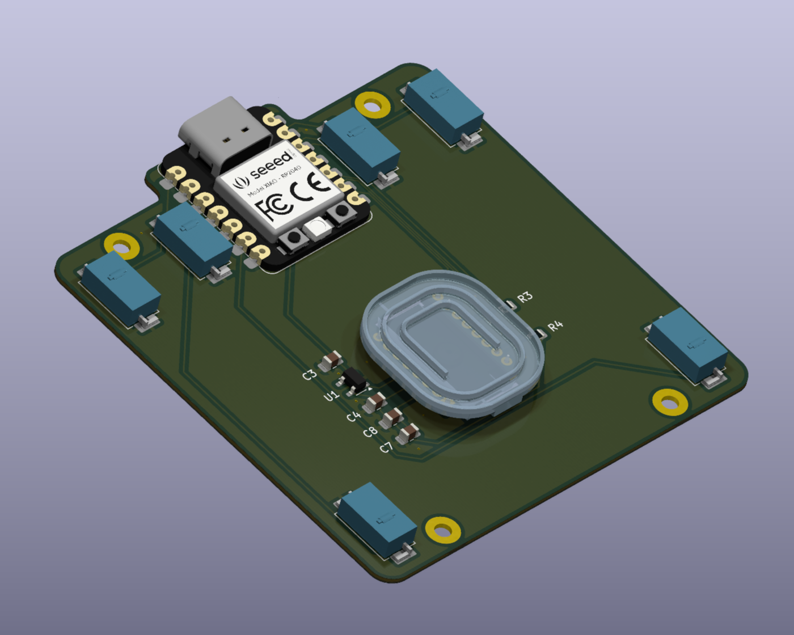

<head>
    
</head>

# PCB

## KiCAD Preview

<!-- NOTE: This might be possible with an embed from releases like IBOM thanks to KiBot -->
<!-- NOTE: This should come from either main or the last release (after release) -->

<kicanvas-embed controls="full">
    <kicanvas-source src="https://raw.githubusercontent.com/TweetyDaBird/Lotus-58-Classic/refs/heads/release/Lotus%2058%20Classic/v1.28/Lotus58_Glow_128.kicad_pro"></kicanvas-source>
    <kicanvas-source src="https://raw.githubusercontent.com/TweetyDaBird/Lotus-58-Classic/refs/heads/release/Lotus%2058%20Classic/v1.28/Lotus58_Glow_128.kicad_sch"></kicanvas-source>
    <kicanvas-source src="https://raw.githubusercontent.com/TweetyDaBird/Lotus-58-Classic/refs/heads/release/Lotus%2058%20Classic/v1.28/Lotus58_Glow_128.kicad_pcb"></kicanvas-source>
</kicanvas-embed>

[Open in a new window](https://kicanvas.org/?github=https://github.com/TweetyDaBird/Lotus-58-Classic/tree/release/Lotus%2058%20Classic/v1.28)

<!-- ## Schematics

<kicanvas-embed id="lt6c-schematic" src="https://raw.githubusercontent.com/TweetyDaBird/Lotus-58-Classic/refs/heads/release/Lotus%2058%20Classic/v1.28/Lotus58_Glow_128.kicad_sch" controls="basic"> </kicanvas-embed>

## Board

<kicanvas-embed id="lt6c-pcb" src="https://raw.githubusercontent.com/TweetyDaBird/Lotus-58-Classic/refs/heads/release/Lotus%2058%20Classic/v1.28/Lotus58_Glow_128.kicad_pcb" controls="basic"> </kicanvas-embed> -->

## Interactive BOM

<!-- NOTE: This should use IBOM from Github main branch or Release -->

<object type="text/html" data="/ibom/lt6c/index.html" width="100%" height="920"></object>

[Interactive BOM](./assets/ibom.html)
